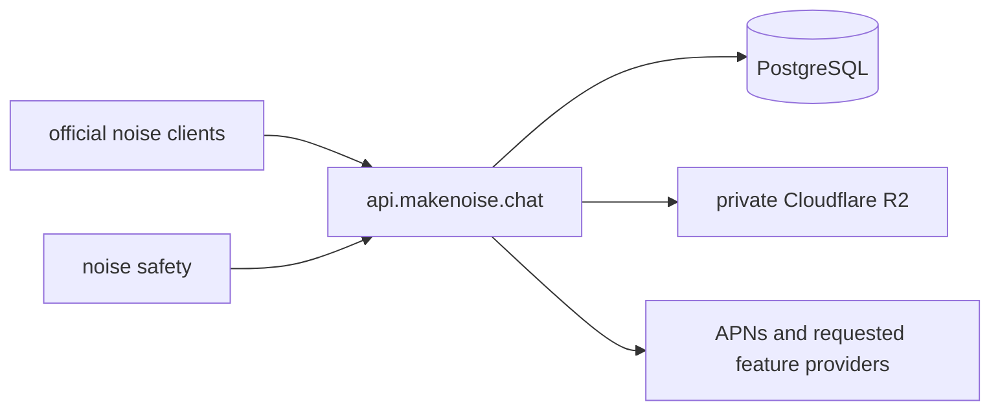

<p align="center">
  
</p>

<p align="center">
  <strong>A private, group-first messenger built around the people you actually choose.</strong>
</p>


<p align="center">
  <a href="https://app.makenoise.chat"><strong>Open noise on the web</strong></a>
  ·
  <a href="https://github.com/GnosysLabs/noise/releases/latest"><strong>Download for macOS or Windows</strong></a>
</p>

noise has no algorithmic feed, follower economy, public group directory, phone
number, or email signup. Create a group, share its private 12-digit frequency,
and make a room that feels like your people.

The official apps use one centrally operated service for reliable delivery,
device synchronization, encrypted media storage, push notifications, and
safety enforcement. Conversations remain end-to-end encrypted: clients create,
encrypt, and sign events before sending them, and the service stores ciphertext
rather than message or media plaintext.

noise is early-alpha software. It is ready for experimentation and real
communities, but it is not an emergency service, archival guarantee, or promise
of high-risk anonymity.

## What noise includes

- **Group-first communities.** Groups have topics, roles, rules, custom
  appearance, replies, reactions, media galleries, and granular moderator
  permissions.
- **Private direct messages.** DMs support encrypted messages and media,
  delivery and read receipts, disappearing messages, replies, and deletion
  controls.
- **Person-to-person discovery.** Groups spread through 12-digit frequencies,
  not search rankings or recommendations.
- **Pseudonymous accounts.** An account uses a random noise ID, password-derived
  credentials, and cryptographic keys instead of a phone number or email
  address.
- **Photos, videos, GIFs, stickers, and clips.** Media is encrypted locally
  before upload. The optional GIF keyboard is powered by KLIPY.
- **Adult content controls.** noise is for adults 18 and older. Groups containing
  sexual content or nudity are labeled, hidden by default, and shown only after
  the account enables them.
- **Two levels of moderation.** Founders and moderators handle community rules.
  A separate encrypted safety-report flow is reserved for a small set of severe
  platform-wide concerns.

## Architecture

noise is a centrally operated, end-to-end encrypted service.



The central service is the authoritative transport and synchronization layer:

- PostgreSQL stores pseudonymous accounts and devices, group membership,
  canonical event order, encrypted events and account vaults, receipts,
  deletion state, and safety restrictions.
- Cloudflare R2 stores complete encrypted media objects. Media is no longer
  split into relay shards.
- Durable cursor-based catch-up closes gaps after disconnects; realtime
  notifications make active conversations update quickly.
- Safety actions can hide an event, temporarily or indefinitely restrict a
  group, or restrict an identity in official noise apps.

Centralization is an explicit reliability tradeoff. It gives one operator more
pseudonymous relationship and delivery metadata, while removing independent
node latency, version skew, divergent histories, and unenforceable safety
states from the official experience.

## Encryption and trust boundaries

The service does not need plaintext conversations to operate noise:

- identity private keys are generated and held by clients;
- passwords are used locally to derive account-vault credentials and are not
  sent to the service;
- group and DM events are encrypted and signed before upload;
- media is encrypted and authenticated before it reaches R2;
- the exact birth date used for the 18+ check is evaluated locally and is not
  stored; and
- clients verify signatures, event IDs, membership transitions, author
  sequences, and encrypted media integrity before displaying content.

The service necessarily processes operational metadata such as pseudonymous
public keys, group and thread relationships, event timestamps and sizes,
encrypted object identifiers, push routing, safety state, and connection
timing. See the current [Privacy Policy](https://makenoise.chat/privacy/) and
[Terms of Service](https://makenoise.chat/terms/) for the complete public
description.

No encrypted messenger can prevent a recipient from taking a screenshot,
exporting content, modifying a client, or retaining something after it has been
decrypted on their device.

## Safety and community moderation

Group founders remain responsible for their communities. They can appoint
moderators and decide whether each moderator may manage identity, appearance,
settings, topics, reports, messages, bans, or unbans.

Ordinary reports—such as group-rule violations, harassment, spam, and
improperly labeled sexual content—stay with group staff. Severe reports sent to
noise safety are encrypted to a separate reviewer key. They may include the
reported message text and signed context, but never reported media bytes or
media decryption keys.

## Development

### Requirements

- Node.js 22+
- pnpm 10+
- current stable Rust
- platform requirements for Tauri 2
- PostgreSQL 16 for the central service
- `wasm32-unknown-unknown` and `wasm-bindgen` for a production web build

### Desktop client

The macOS and Windows apps share the React interface and Rust client:

```sh
pnpm --dir apps/client install --frozen-lockfile
pnpm --dir apps/client dev:desktop
```

### Web client

The production web build compiles the Rust client to WebAssembly and creates
content-hashed assets:

```sh
pnpm --dir apps/client install --frozen-lockfile
pnpm --dir apps/client build:web
```

Output is written to `apps/client/dist/`.

### Central service

The central service requires PostgreSQL plus its authentication key and
provider configuration. It binds to loopback and is intended to run behind a
TLS reverse proxy:

```sh
cargo run -p noise-central -- --help
```

The schema is defined by the ordered migrations in `deploy/central/migrations/`.
Production service and reverse-proxy templates live in `deploy/central/`, and
the implemented API routes live in `crates/noise-central/`.

Do not put PostgreSQL passwords, R2 credentials, APNs keys, updater keys, or
noise safety recipient keys in source control.

## Repository map

- `apps/client` — shared React interface, web build, and Tauri desktop shell
- `apps/marketing` — public `makenoise.chat` website and legal pages
- `crates/noise-central` — centrally operated API, synchronization, media, and
  push service
- `crates/noise-client` — reusable account, group, topic, DM, media, and
  moderation operations
- `crates/noise-core` — cryptographic identities, signed events, MLS state, and
  protocol types
- `crates/noise-web` — WebAssembly bridge for the browser client
- `crates/noise-ffi` — native JSON bridge used by desktop and iOS
- `noiseSaftey` — encrypted report intake, private reviewer, and signed
  directive tooling
- `crates/noise-migration-importer` and `crates/noise-migration-verifier` —
  one-time migration tooling for the retired relay system

The legacy relay crates and documents remain in the repository only as
historical and one-time migration material. Official clients do not use them,
and independent relays are not part of the production noise architecture.

## Contributing

Issues and focused pull requests are welcome:

- [Report a bug or request a feature](https://github.com/GnosysLabs/noise/issues)
- [Read the source](https://github.com/GnosysLabs/noise)

Please do not submit credentials, private report contents, decrypted user
content, or real account vaults with a bug report.

## License

noise-authored code in this repository is licensed under the
[GNU Affero General Public License, version 3 only](LICENSE)
(`AGPL-3.0-only`), copyright © 2026 Gnosys Labs LLC.

If you modify noise and make that modified version available for people to use
over a network, you must offer those users the corresponding source code as
required by section 13 of the AGPL. Third-party dependencies and assets remain
under their respective licenses.
