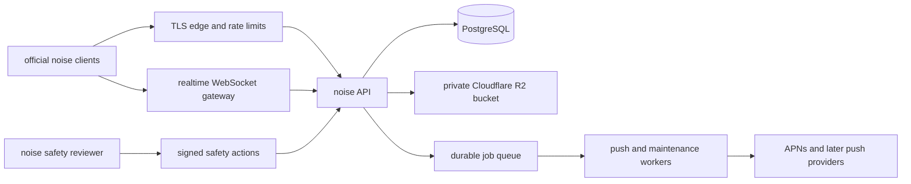

# noise centralized service architecture

- Status: accepted direction for implementation planning
- Decision date: 2026-07-27
- Implementation status: not started
- Media storage: Cloudflare R2 selected
- Deployment model: local development followed by production; no staging environment

## Decision

noise will become a centrally operated, end-to-end encrypted service.

Official clients will connect to one logical noise service operated by Gnosys
Labs. Independently operated relays will not participate in the production
network. The service may run across multiple machines, providers, and regions,
but it will have one compatibility policy, one authoritative event history,
and one accountable operator.

Centralization changes transport, storage, synchronization, and operational
authority. It does **not** authorize the server to receive plaintext messages,
plaintext media, account passwords, MLS secrets, or identity private keys.

The intended product statement is:

> noise is a private, group-first messenger with end-to-end encrypted
> conversations operated as one reliable service.

## Why this decision is being made

The independent-relay design gives noise infrastructure diversity and
censorship resistance, but it also makes the official experience depend on
machines and operators that noise cannot monitor, repair, upgrade, or require
to meet a service level.

As the relay network grows, official clients must account for:

- variable relay latency, capacity, and uptime;
- version skew and partial protocol upgrades;
- relay discovery and public-key rotation;
- malicious or incorrectly configured operators;
- publication fan-out and partial acceptance;
- merging, deduplicating, and reconciling divergent relay responses;
- media placement and reconstruction across changing relay constellations;
- safety restrictions that independent storage operators need not honor; and
- support incidents whose cause may be outside noise's control.

Users experience all of these as noise reliability problems regardless of
which operator caused them. A central service moves these failure domains into
infrastructure that noise controls and can observe.

## Goals

1. Provide one predictable official experience across web, macOS, Windows,
   iOS, and later clients.
2. Keep message, media, group-state, and direct-message content end-to-end
   encrypted.
3. Keep identity private keys and account passwords on user devices.
4. Give every group and conversation one canonical ordered history.
5. Make writes idempotent, acknowledgement explicit, and offline catch-up
   deterministic.
6. Preserve local-first interaction: local settings and pending messages must
   not wait for unrelated network synchronization.
7. Operate multiple physical failure domains without exposing infrastructure
   topology to users.
8. Make safety actions enforceable by the service and official clients.
9. Migrate existing accounts, groups, messages, topics, DMs, and media without
   changing their cryptographic identities or losing signed history.
10. Remove independent-relay and OHTTP complexity after the compatibility
    window closes.

## Non-goals

Centralization will not:

- give the service plaintext access to conversations or media;
- add phone-number, email-address, address-book, or legal-name requirements;
- add a public group directory, algorithmic feed, or recommendation system;
- make noise safety an emergency service;
- make it possible to recall content already decrypted or saved by a device;
- make an unofficial modified client delete its local data;
- guarantee anonymity against a global network observer; or
- retain third-party relay operation as a supported production feature.

## What remains end-to-end encrypted

The following existing boundaries remain:

- Identity keys are generated and held by clients.
- Events are signed by the authoring identity.
- Group messages and control records use the MLS and archive-root design.
- DMs use the same end-to-end encrypted event model.
- Media is encrypted and authenticated before upload.
- The synchronized account vault remains password-encrypted and signed.
- The service stores ciphertext, signatures, public routing fields, and
  operational metadata.
- Clients continue to verify signatures, event IDs, MLS epochs, membership
  transitions, author sequences, and application authorization before
  displaying an event.

The service becoming authoritative for ordering and availability does not make
it cryptographically authoritative for message contents. A compromised service
may withhold, delay, reorder for attempted delivery, or delete ciphertext. It
must not be able to forge an accepted user event or decrypt its payload.

## Accepted metadata tradeoff

A central service necessarily concentrates metadata that independent relays
previously saw in fragments. The service will know, at minimum:

- pseudonymous account and device public keys;
- group and stream identifiers;
- group membership needed for authorization and delivery;
- event authors, sizes, timestamps, and canonical cursors;
- encrypted media object identifiers and byte sizes;
- push subscription routing;
- safety restrictions and enforcement state; and
- connection timing and network-edge metadata.

The service will not require identity PII. Application servers should not
receive the original client IP when the network edge can remove it, and
application logs must not record request bodies, ciphertext payloads, group
membership lists, account vaults, device tokens, or stable IP histories.

This is an explicit trade: noise gains reliability and operational control
while accepting that one operator can observe more pseudonymous relationship
metadata than any one independent relay previously could.

## Target system

This is one logical service, not one physical server. Initially it may run in
one primary region with tested backups and a warm recovery path. Additional API
instances, database replicas, object-storage replication, and regional edges
can be added without changing the client protocol.

### 1. TLS edge

The public edge:

- terminates TLS;
- applies request-size limits and abuse-rate controls;
- routes API and WebSocket traffic;
- removes or minimizes source-address metadata passed to the application;
- uses short, documented network-log retention; and
- never logs request or response bodies.

The first-party application must not depend on a particular CDN. The edge can
be replaced without changing identity or conversation data.

### 2. API service

The API service:

- authenticates devices through signed challenges;
- accepts and validates signed encrypted envelopes;
- authorizes group and DM access;
- assigns canonical monotonic cursors;
- commits events and related state transactionally;
- returns idempotent success for an already accepted event ID;
- provides bounded cursor pagination;
- issues encrypted-media upload and download capabilities;
- manages encrypted account-vault revisions;
- registers push subscriptions; and
- enforces active safety restrictions.

The API must not receive an account password. After restoring and decrypting an
account vault locally, a client proves control by signing a server nonce with
the restored identity or registered device key. The server returns a
short-lived, device-bound session.

### 3. Realtime gateway

Official clients maintain one reconnectable WebSocket session. It carries only
notifications and encrypted envelopes authorized for that session.

Each notification includes a durable cursor. Reconnection always performs
cursor-based catch-up from PostgreSQL; WebSocket delivery is an optimization,
not the source of truth. A disconnect therefore cannot create a permanent gap.

Presence remains ephemeral and may be lossy. Messages, membership changes,
moderation events, safety actions, and account-vault revisions are durable.

### 4. PostgreSQL

PostgreSQL is the authoritative metadata and ordered-event store. The initial
logical schema should include:

| Area | Stored state |
|---|---|
| accounts | identity public key, status, creation time |
| devices | device public key, account binding, revocation state |
| account vaults | opaque locator, revision, encrypted vault, signature |
| groups | group ID, lifecycle and safety status |
| memberships | group ID, pseudonymous account key, role and active interval |
| streams | group/topic stream identifiers and latest cursor |
| events | event ID, group/DM scope, author key, sequence, ciphertext envelope, signature, canonical cursor |
| MLS control | genesis and epoch records with unique parent/epoch constraints |
| invitations | rate-limited rendezvous records and rotation state |
| direct threads | participant bindings and durable event cursors |
| media objects | opaque object ID, encrypted byte length, storage state, deletion capability hash |
| push subscriptions | installation routing and delivery-deduplication state |
| safety actions | signed restriction, target, reason code, issue/expiry state |
| idempotency | bounded request keys for retry-safe mutations |

Large media bytes do not belong in PostgreSQL. Account vaults and event
envelopes may move to managed blob storage later if their measured size
requires it, but their revisions and commit records remain transactional.

### 5. Cloudflare R2 encrypted object storage

Cloudflare R2 is the selected storage provider for encrypted media. The bucket
is private. It must not expose an `r2.dev` address, public bucket access, or a
public custom domain.

New media keeps the current client-side encryption and authenticated block
format but stops using client-selected Reed-Solomon placement across
independent relays. R2 receives only ciphertext with
`application/octet-stream`; it never receives the media key, plaintext MIME
type, group ID, account ID, username, or original filename.

R2 object keys are generated by the service from opaque random upload IDs and
authenticated encrypted-object IDs. They must not contain user-controlled path
segments or stable account/group identifiers. R2 custom metadata must not
contain identity, membership, IP-address, or report data.

For new uploads:

1. The client transforms and encrypts media locally.
2. The API creates a pending media record and server-generated R2 object keys.
3. The API returns short-lived, object-specific presigned PUT capabilities and
   their expiration time. No R2 credential is sent to the client.
4. The client uploads encrypted blocks directly to R2 with their exact lengths
   and required checksum headers.
5. The client asks the API to finalize the upload.
6. The service verifies the expected object IDs, hashes, byte lengths, block
   count, and completed R2 objects before making the media reference usable.
7. Unfinalized objects remain under the `temporary/` prefix and are removed
   after one day by a bucket lifecycle rule. Completed objects never remain
   under that prefix.
8. The signed encrypted message references the completed opaque object.

Downloads use short-lived, object-specific presigned GET capabilities or an
authenticated service/Worker path. A capability is a bearer secret: it must be
bound to one object, expire quickly, and never appear in application logs.
Clients continue to verify authenticated object IDs after download, so an
incorrect or corrupted R2 response fails closed.

The web origin requires a narrow R2 CORS policy for
`https://app.makenoise.chat` and only the required `GET`, `HEAD`, and `PUT`
methods and headers. Desktop and native clients use the same capabilities but
do not depend on browser CORS.

The service uses separate least-privilege credentials:

- a runtime credential limited to the production media bucket and required
  object read/write operations; and
- an administrative credential used only for bucket policy, CORS, lifecycle,
  and other configuration changes.

Neither credential is committed to source, included in a client build, or
printed in logs. The S3-compatible client uses R2's required `auto` region and
the account-specific endpoint.

Active conversation media initially uses R2 Standard storage. A colder storage
class is not selected until measured access patterns and deletion behavior show
that its retention and retrieval tradeoffs are appropriate.

Durability comes from R2's managed storage plus noise-owned inventory,
integrity verification, and tested recovery procedures. The service database
remains the authoritative record of which objects should exist. A periodic
inventory compares committed database objects with R2 and reports missing,
unexpected, or incomplete objects without logging their user relationships.
The object store never receives plaintext media or its decryption key.

Deletion removes every service-controlled copy and backup according to a
documented retention window. It cannot erase a copy already downloaded,
decrypted, or saved by another person.

### 6. Durable workers

Workers handle work that must not delay an interactive acknowledgement:

- APNs and later push delivery;
- retrying transient notification failures;
- media finalization and garbage collection;
- expired invitation and session cleanup;
- safety-expiry processing;
- backup verification;
- retention jobs; and
- operational repair.

Jobs must be durable, idempotent, bounded, and observable. A client-visible
write succeeds only when its authoritative database transaction succeeds, not
when every downstream job finishes.

## Event and consistency model

### Messages and ordinary group events

1. The client creates, encrypts, and signs the event.
2. The event appears locally with a visible pending state.
3. The client sends it with its stable event ID and an idempotency key.
4. The service verifies the envelope, current membership, author sequence,
   size, and safety state.
5. One transaction stores the event and assigns its canonical cursor.
6. The service acknowledges the event.
7. Realtime delivery and push fan-out happen after commit.

A retry with the same valid event ID returns the existing result. It must not
create a duplicate message.

The client remains responsible for cryptographic and application-level
verification. The server cursor defines transport order, not permission to
decrypt or display an invalid event.

### MLS control log

The central database replaces relay-by-relay epoch reconciliation. Transactional
constraints admit only one accepted child for an MLS parent epoch. Competing
commits fail deterministically.

The service verifies signatures, group binding, parent references, and
structural bounds. It never receives MLS epoch secrets or archive roots.

This removes the requirement that every configured relay advertise compatible
MLS capabilities before a group can advance.

### Accounts and cross-device state

The encrypted account vault uses compare-and-swap revisions:

1. A client fetches revision `N`.
2. It merges and encrypts its local update.
3. It submits revision `N + 1` with `If-Match: N`.
4. The service commits it only if `N` is still current.
5. On conflict, the client fetches, verifies, merges, and retries deliberately.

Local safety and visibility choices apply to the current device immediately.
Cross-device vault publication happens afterward and must not keep a local
toggle, cache purge, block, or leave action visibly waiting on the network.

### Offline catch-up

Every durable scope has an opaque cursor. Clients persist the last fully
applied cursor only after the corresponding local state is durable.

On reconnect, the client requests events after that cursor, validates and
applies them in order, then advances the local cursor. A crash before the cursor
commit safely replays idempotent events.

### Direct messages

DMs use one canonical two-party encrypted event stream. The service stores one
event copy, not one copy per device. Authorized devices catch up by cursor.
Push workers notify registered installations without receiving plaintext.

## Invitations and frequencies

The 12-digit frequency remains a human rendezvous code, not an encryption key.
Centralization makes online rate limiting enforceable but does not make the
small code space safe against an operator that can inspect a simple verifier.

Before noise describes frequencies as resistant to offline guessing, the
central service must use an augmented PAKE or equivalent design. It should:

- bind requests to a short-lived invite generation;
- enforce global and scoped attempt limits;
- rotate the capability after a ban or founder action;
- avoid storing a directly testable plaintext-equivalent verifier; and
- reveal no group name, artwork, membership, or content before successful
  rendezvous.

## Safety and moderation

Group founders and moderators continue to handle ordinary community rules.
noise safety continues to receive only the severe categories documented in
`docs/SAFETY.md`.

Centralization improves enforcement:

- a hidden event is no longer returned by official service APIs;
- a paused or blocked group cannot publish or fetch through the service;
- a blocked identity cannot create a valid service session or publish;
- encrypted media under service control can be deleted;
- restrictions apply immediately to WebSocket delivery and new API requests;
- clients still receive signed restrictions so cached/offline content is
  purged and remains hidden; and
- every reviewer action has an immutable audit record.

Centralization does not let reviewers inspect encrypted group history. The
sealed-report boundary, content minimization, and prohibition on manually
forwarding unknown media remain.

## OHTTP decision

OHTTP will be removed from the normal production path after the compatibility
window.

Today OHTTP separates a client-facing mask relay from a storage relay so one
relay need not know both the source address and destination request. In a
fully noise-operated service, both roles ultimately belong to the same
organization, so the non-collusion benefit is substantially weaker while the
latency, key distribution, response-size limits, routing failures, and
debugging costs remain.

The centralized privacy boundary will instead be:

- ordinary TLS;
- a replaceable network edge separated from application data;
- no request-body logging;
- minimal, short-lived edge metadata;
- no stable IP history in application databases; and
- device-signed authentication rather than IP-based identity.

OHTTP may be reconsidered for narrowly defined fetches only if noise later uses
a genuinely independent gateway and the measured privacy benefit justifies the
operational cost. It is not part of the initial centralized architecture.

## Code that remains valuable

The pivot preserves:

- `noise-core` identity, event, signing, MLS, encryption, and reducer logic;
- encrypted account vaults and account recovery;
- local state, caches, offline behavior, and view models in `noise-client`;
- the shared React/Tauri/web interface;
- native media transformation and encrypted block handling;
- safety-report signing, sealing, review, and signed client enforcement;
- the client/transport API boundary; and
- protocol simulators and cryptographic test vectors.

The independent-node work was therefore not wasted. It created a client-side
trust model that remains useful when the service is compromised or curious.

## Code and operations to retire

After migration and the supported-client window, remove or retire:

- relay discovery and signed relay directories;
- user- or operator-selected relay constellations;
- mask-relay selection and OHTTP keys/routes;
- multi-relay publication loops and partial-acceptance semantics;
- response merging and cross-relay deduplication;
- relay capability negotiation and version-skew gates;
- client-managed Reed-Solomon placement for new media;
- peer gossip and relay snapshots;
- independent relay packages, release channels, update timers, and operator
  documentation; and
- marketing claims centered on independently operated infrastructure.

The existing relay HTTP surface should remain temporarily as a compatibility
adapter, not as the target API.

## Migration plan

Migration must be staged. No production data is deleted merely because a new
service answers requests.

### Phase 0: freeze and inventory

- Stop adding features that depend on independent relay operation.
- Keep the current two official relays healthy and unchanged.
- Snapshot both relay databases, shard stores, configurations, and exact
  software versions.
- Inventory verified account-vault revisions, invitations, events, MLS
  records, deletion records, push subscriptions, and media shards.
- Record counts, byte totals, and cryptographic hashes per source.
- Exercise restore using copies, never the live stores.

Exit condition: noise can describe exactly what exists on each relay and can
restore both snapshots into isolated test instances.

### Phase 1: central compatibility service

Build the first central service to accept the existing signed and encrypted
objects while writing them into the target database and object store.

- Deduplicate events by verified event ID.
- Choose the highest valid signed account-vault revision per locator.
- Reject conflicting immutable objects instead of silently choosing one.
- Preserve group IDs, identity keys, event IDs, author sequences, timestamps,
  stream locators, MLS records, and signatures.
- Import every legacy media shard and tombstone into private R2 namespaces
  without changing its shard ID, payload hash, deletion-capability hash, or
  deleted state.
- Preserve the two existing relay domains as compatibility aliases backed by
  the central service.

Keeping the old domains matters because existing signed media manifests contain
their provider addresses. The central compatibility layer must continue to
serve those `/v4/shards` paths until all referenced media has a durable central
resolution path.

Exit condition: a copied current client can restore every test account, open
every group/topic/DM, paginate history, and retrieve representative media using
only the compatibility service.

### Phase 2: central API and dual compatibility

- Introduce the canonical API hostname.
- Add signed device sessions and short-lived tokens.
- Add canonical database cursors and the realtime WebSocket gateway.
- Have new clients use the central API.
- Continue serving old relay endpoints for released clients.
- Mirror each accepted central event into a replayable relay-format migration
  journal during the rollback window.
- Keep account vaults, invitations, and MLS records readable through both
  surfaces with identical verified results.

Exit condition: new and old supported clients can communicate across the
compatibility boundary without duplicate or missing events.

### Phase 3: central media

- Use the private Cloudflare R2 media bucket for all new encrypted media.
- Provision one production media bucket. Local development and automated tests
  use an isolated local object-store adapter and never receive production R2
  credentials.
- Configure the exact web CORS origin, temporary-object lifecycle, and
  least-privilege runtime/admin credentials.
- Validate direct encrypted-block PUT, HEAD, GET, deletion, interrupted upload,
  checksum failure, expired capability, and browser CORS behavior.
- Keep legacy `/v4/shards` reads available.
- Allow an upgraded authorized client to reconstruct old encrypted objects and
  register a central encrypted copy without revealing plaintext.
- Map the immutable object ID to the central copy so old signed message events
  do not need to be rewritten.
- Verify images, audio range playback, video bootstrap ranges, deletion, cache
  purge, and interrupted-upload garbage collection.

Exit condition: new media no longer depends on shard placement, and every
existing referenced object remains retrievable or is explicitly recorded as
already missing before migration.

### Phase 4: safety cutover

- Make the service enforce active group, event, and identity restrictions at
  read, write, realtime, and media-capability boundaries.
- Retain signed directives for client cache purging and offline enforcement.
- Verify that restrictions never expose report contents to the public service.
- Verify that restoring a restriction follows the documented signed workflow.

Exit condition: server enforcement and client enforcement agree for every
action available in the reviewer.

### Phase 5: remove independent-relay paths

Only after the minimum supported client version uses the central API:

- stop relay discovery;
- stop publishing signed relay descriptors;
- stop accepting third-party relay announcements;
- remove OHTTP from clients and the primary service;
- stop producing independent relay packages and signed update channels;
- convert old relay domains to documented compatibility aliases;
- archive independent-operator documentation; and
- update the README, protocol, media, safety, privacy, terms, and marketing
  language.

Legacy media endpoints remain available for as long as supported signed history
can reference them.

## Existing-user acceptance

The initial migration covers a small known account set, but it must use the
same verifiable process expected at larger scale.

For every existing account, verify:

- the noise ID restores the same identity public key;
- the highest account-vault revision and signature match;
- the same groups and DMs are present;
- founder, moderator, member, ban, and block state match;
- topic identity and history match;
- event counts and event-ID sets match after deduplication;
- latest and older pagination contain no gaps;
- explicit-content settings remain hidden or enabled as selected;
- safety restrictions and completed cache purges remain effective;
- representative images, audio, and video can be reconstructed;
- leaving, deleting, blocking, and restoring behave consistently; and
- a central outage does not corrupt the local vault or erase readable cached
  content.

Migration evidence must use copied production data and recorded hashes. A clean
new test group is not sufficient proof.

## Rollback

Every phase retains a rollback path:

- Keep immutable pre-migration snapshots of both official relay databases and
  shard stores.
- Keep old relay binaries, configurations, and deployment records.
- Do not mutate signed historical objects during import.
- Keep a replayable journal of writes accepted after central dual operation
  begins.
- Do not begin central-only writes until the journal can rebuild a compatible
  store from a snapshot.
- Back up PostgreSQL and object storage before every destructive migration.
- Test database and media restoration before declaring a phase complete.
- If central cutover fails, restore the last verified central snapshot or
  rebuild from the old snapshots plus the accepted-write journal.

Rollback does not mean silently returning users to independently selected
third-party relays. It means restoring the previous official transport while
preserving every accepted signed object.

## Reliability and performance acceptance

The first production central release must demonstrate:

- one committed copy of each event ID despite client retries;
- no acknowledged message loss across API, database, worker, or WebSocket
  restart;
- deterministic cursor catch-up after disconnect and device sleep;
- immediate local application of visibility, block, leave, and cache-purge
  actions;
- visible pending and failure state for unsent messages;
- bounded first-page history queries independent of total group history;
- a 50,000-member group design that does not store one message copy per
  recipient;
- database backup restoration into an isolated environment;
- object-store restoration and deletion verification;
- R2 inventory reconciliation and temporary-object cleanup;
- expiry and revocation of device sessions;
- a tested response to database unavailability, queue backlog, and push
  failure;
- monitoring for API latency, error rate, WebSocket connections, database
  saturation, queue age, storage errors, and backup freshness; and
- no application logs containing request bodies, encrypted account vaults,
  device tokens, report plaintext, or stable IP histories.

Initial service objectives should be measured before being promised publicly.
The engineering targets are:

- interactive API acknowledgement p95 below 500 ms under expected launch load;
- initial history page p95 below 1 second;
- realtime delivery p95 below 1 second when both devices are online; and
- at least 99.9% monthly availability after the recovery path has been tested.

## Security review gates

Before declaring the centralized service production-ready:

- independently review MLS and archive-root behavior;
- threat-model the central membership and metadata store;
- verify signed device authentication and session revocation;
- rate-limit frequency rendezvous without creating an offline verifier;
- test replay, duplicate, reordered, conflicting, and forged events;
- test authorization on every group, DM, media, and realtime endpoint;
- verify object-store capabilities cannot enumerate unrelated media;
- test account-vault compare-and-swap conflicts;
- encrypt backups and restrict restore credentials;
- separate safety-review secrets from public API infrastructure;
- document edge metadata and retention;
- run restore, failover, slow-client, reconnect-storm, and large-group tests;
  and
- obtain an independent security review before making strong production E2EE
  claims.

## Documentation affected by implementation

The following documents describe the current independent-relay system and must
not be silently left as product claims after cutover:

- `README.md`
- `docs/PROTOCOL.md`
- `docs/CLIENTS.md`
- `docs/MEDIA_V2.md`
- `docs/PRODUCTION-E2EE.md`
- `docs/RELAY_RELEASES.md`
- `docs/SAFETY.md`
- the privacy policy, terms, marketing site, and in-app explanatory copy

They should be updated only when the corresponding implementation boundary is
true in released clients and production. This decision document describes the
target; it does not make the current deployment centralized.

## Immediate next work

Before implementation:

1. Produce a read-only inventory of both official relay stores and current
   client endpoint behavior.
2. Provisioned 2026-07-27: the private `noise-media-production` Cloudflare R2
   bucket uses Standard storage, no public URL or custom domain, narrow
   production-web CORS, and one-day `temporary/` cleanup. Create its
   bucket-scoped runtime credential only when the production service has a
   protected secret destination. Local development uses an isolated adapter;
   there is no staging deployment.
3. Choose the initial PostgreSQL, queue, and deployment providers.
4. Define the signed device-session protocol and minimum server-visible
   membership record.
5. Specify the canonical event and cursor schema.
6. Specify legacy media compatibility and central R2 object resolution.
7. Build the migration verifier before writing the importer.
8. Review this document and explicitly approve any change to the privacy
   boundary before code changes begin.
